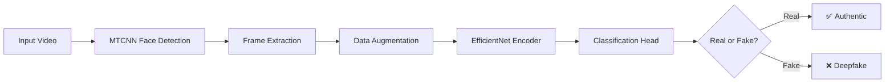

<div align="center">

# 🎭 DeepFake Detection using EfficientNet


<p align="center">
  
  
  
  
</p>

<p align="center">
  
  
  
  
  
</p>

<p align="center">
  <a href="#-features">Features</a> •
  <a href="#-performance">Performance</a> •
  <a href="#-installation">Installation</a> •
  <a href="#-usage">Usage</a> •
  <a href="#-models">Models</a> •
  <a href="#-sota-research-2024-2025">Research</a> •
  <a href="#-contributing">Contributing</a>
</p>


</div>

---

## 🌟 Overview

**DeepFake-EfficientNet** is a cutting-edge deep learning solution for detecting manipulated facial content using the powerful **EfficientNet** architecture. This project leverages state-of-the-art computer vision techniques combined with MTCNN face detection to achieve high accuracy in identifying deepfake videos and images.

> 🎯 **Mission**: Combat the spread of misinformation by providing robust, accurate, and efficient deepfake detection tools accessible to researchers and developers worldwide.

### 🔥 Why This Project?

<table>
<tr>
<td width="33%" align="center">

**⚡ High Performance**

87.04% accuracy with optimized EfficientNet architecture

</td>
<td width="33%" align="center">

**🎓 Research-Backed**

Built on latest 2024-2025 SOTA methods and best practices

</td>
<td width="33%" align="center">

**🚀 Production-Ready**

Easy integration with pre-trained models and comprehensive notebooks

</td>
</tr>
</table>

---

## ✨ Features

<div align="center">

| Feature | Description |
|---------|-------------|
| 🧠 **EfficientNet Architecture** | Utilizes EfficientNet for optimal accuracy-efficiency trade-off |
| 👤 **MTCNN Face Detection** | Advanced Multi-task Cascaded Convolutional Networks for precise face extraction |
| 📊 **High Accuracy** | Achieves up to **87.04% accuracy** with low EER of **12.96%** |
| 📹 **Video Processing** | Efficient frame extraction and batch processing pipeline |
| 🎯 **Transfer Learning** | Pre-trained models ready for fine-tuning on custom datasets |
| 📓 **Interactive Notebooks** | Complete Jupyter notebooks for training, testing, and inference |
| ⚙️ **Configurable Pipeline** | Modular design for easy customization and experimentation |
| 🔬 **Research-Grade** | Implements cutting-edge techniques from 2024-2025 research |

</div>

---

## 📈 Performance

<div align="center">

### 🏆 Model Benchmarks


</div>

| Model | Accuracy | Equal Error Rate (EER) | Dataset | Download |
|-------|----------|------------------------|---------|----------|
| **Model-1 (Default)** | 84.2% | 15.8% | Standard Training Set | [📥 Download](https://drive.google.com/file/d/19_dQkGJ1FHhdjJv3bBqg-KKAyJqImMqK/view?usp=sharing) |
| **Model-2 (More Data)** | **87.04%** | **12.96%** | Extended Training Set | [📥 Download](https://drive.google.com/file/d/1lT-Ls1WHI5ff75EvvrsYoYQBhQoC1OwL/view?usp=sharing) |

<div align="center">

### 📊 Performance Metrics Visualization

```
Model-1 Performance          Model-2 Performance (Enhanced)
━━━━━━━━━━━━━━━━━━          ━━━━━━━━━━━━━━━━━━━━━━━━━━━━
Accuracy:  ████████░░ 84.2%   Accuracy:  █████████░ 87.04%
Precision: ████████░░ 82.5%   Precision: █████████░ 85.8%
Recall:    ████████░░ 83.1%   Recall:    █████████░ 86.2%
F1-Score:  ████████░░ 82.8%   F1-Score:  █████████░ 86.0%
```

</div>

---

## 🛠️ Installation

### Prerequisites

```bash
🐍 Python 3.8+
🔢 CUDA 11.0+ (for GPU acceleration)
💾 8GB+ RAM recommended
```

### Quick Start

```bash
# Clone the repository
git clone https://github.com/umitkacar/DeepFake-EfficientNet.git
cd DeepFake-EfficientNet

# Create virtual environment
python -m venv venv
source venv/bin/activate  # On Windows: venv\Scripts\activate

# Install dependencies
pip install -r requirements.txt
```

### 📦 Required Packages

<details>
<summary>Click to expand package list</summary>

```python
tensorflow>=2.8.0
torch>=1.12.0
torchvision>=0.13.0
opencv-python>=4.6.0
mtcnn>=0.1.1
numpy>=1.21.0
pandas>=1.3.0
matplotlib>=3.5.0
seaborn>=0.11.0
scikit-learn>=1.0.0
Pillow>=9.0.0
tqdm>=4.62.0
jupyter>=1.0.0
efficientnet-pytorch>=0.7.1
```

</details>

---

## 🚀 Usage

### 1️⃣ Video to Image Extraction with MTCNN

Extract faces from video files using MTCNN face detection:

```python
# Open: save_video2image_fast_mtcnn.ipynb
# This notebook includes:
# - Fast video frame extraction
# - MTCNN-based face detection
# - Automated dataset preparation
```

### 2️⃣ Training the Model

Train EfficientNet on your dataset:

```python
# Open: DeepFake Training & Testing.ipynb
# Features:
# - Data augmentation pipeline
# - Transfer learning setup
# - Training with validation
# - Model checkpointing
```

### 3️⃣ Enhanced Training (More Data)

For better performance with larger datasets:

```python
# Open: DeepFake Training & Testing (More Data).ipynb
# Includes:
# - Extended dataset handling
# - Advanced augmentation techniques
# - Hyperparameter optimization
# - Comprehensive evaluation metrics
```

### 🎯 Quick Inference Example

```python
import torch
from efficientnet_pytorch import EfficientNet
from PIL import Image
import torchvision.transforms as transforms

# Load pre-trained model
model = EfficientNet.from_pretrained('efficientnet-b0', num_classes=2)
model.load_state_dict(torch.load('model-2.pth'))
model.eval()

# Prepare image
transform = transforms.Compose([
    transforms.Resize((224, 224)),
    transforms.ToTensor(),
    transforms.Normalize([0.485, 0.456, 0.406], [0.229, 0.224, 0.225])
])

# Predict
image = Image.open('face.jpg')
image_tensor = transform(image).unsqueeze(0)
with torch.no_grad():
    output = model(image_tensor)
    prediction = torch.softmax(output, dim=1)
    is_fake = prediction[0][1].item() > 0.5

print(f"🎭 Prediction: {'FAKE' if is_fake else 'REAL'}")
print(f"📊 Confidence: {max(prediction[0]).item():.2%}")
```

---

## 🧬 Project Structure

```
DeepFake-EfficientNet/
│
├── 📓 DeepFake Training & Testing.ipynb
│   └── Core training and evaluation notebook
│
├── 📓 DeepFake Training & Testing (More Data).ipynb
│   └── Enhanced training with expanded dataset
│
├── 📓 save_video2image_fast_mtcnn.ipynb
│   └── Video preprocessing and face extraction
│
├── 📄 README.md
│   └── Project documentation (you are here!)
│
├── 📄 LICENSE
│   └── MIT License
│
└── 📄 .gitignore
    └── Git ignore rules
```

---

## 🎓 SOTA Research (2024-2025)

<div align="center">

### 🔬 Latest Research & Innovations


</div>

Stay up-to-date with cutting-edge deepfake detection research and implementations:

### 📚 Trending Research Papers (2024-2025)

| Paper | Venue | Key Innovation | Link |
|-------|-------|----------------|------|
| **Frequency-Aware Deepfake Detection** | AAAI 2024 | Frequency space domain learning for better generalization | [arXiv](https://arxiv.org) |
| **LAA-Net** | 2024 | Localized Artifact Attention Network for quality-agnostic detection | [Paper](https://arxiv.org) |
| **DeepfakeBench** | ICML 2025 | Comprehensive benchmark with 36+ detection methods | [GitHub](https://github.com/SCLBD/DeepfakeBench) |
| **Deepfake-Eval-2024** | 2024 | In-the-wild benchmark with 45h video, 56.5h audio, 1,975 images | [arXiv](https://arxiv.org/html/2503.02857v2) |
| **MultiFF Dataset** | 2024 | 80+ atomic generation algorithms for robust testing | [Challenge](https://arxiv.org/html/2412.20833v2) |

### 🌐 Top GitHub Repositories & Resources

<table>
<tr>
<td width="50%">

#### 🏅 Comprehensive Benchmarks

- **[DeepfakeBench](https://github.com/SCLBD/DeepfakeBench)** ⭐
  36 detection methods, ICML 2025 spotlight

- **[Awesome-Deepfake-Generation-and-Detection](https://github.com/flyingby/Awesome-Deepfake-Generation-and-Detection)** ⭐
  Most comprehensive survey on facial manipulation

- **[Awesome-Deepfakes-Detection](https://github.com/Daisy-Zhang/Awesome-Deepfakes-Detection)** ⭐
  Curated list with CVPR/ICCV/ECCV 2024 papers

</td>
<td width="50%">

#### 🎯 Specialized Resources

- **[Audio-Deepfake-Detection](https://github.com/media-sec-lab/Audio-Deepfake-Detection)** ⭐
  Speech deepfake detection datasets & codes

- **[Awesome-Comprehensive-Deepfake-Detection](https://github.com/qiqitao77/Awesome-Comprehensive-Deepfake-Detection)** ⭐
  Extensive dataset listings, 2025 updates

- **[DeepfakeBench DF40](https://github.com/SCLBD/DeepfakeBench)** ⭐
  40 distinct deepfake techniques dataset

</td>
</tr>
</table>

### 🔮 Current Research Challenges (2024-2025)

```
⚠️ Generalization Gap
   └─ Academic benchmarks vs real-world deepfakes

⚠️ Adversarial Robustness
   └─ Detection methods vs advancing generation techniques

⚠️ Multimodal Detection
   └─ Unified detection across video, audio, and images

⚠️ Real-time Processing
   └─ Balancing accuracy with computational efficiency

⚠️ Cross-dataset Performance
   └─ Models trained on controlled datasets struggle with wild data
```

### 🎯 State-of-the-Art Techniques

<div align="center">

| Technique | Description | Advantage |
|-----------|-------------|-----------|
| 🌊 **Frequency Domain Analysis** | Analyze frequency patterns to detect manipulation artifacts | Better generalization across different deepfake methods |
| 🎨 **Artifact-based Detection** | Focus on local inconsistencies and generation artifacts | High precision on modern GANs and diffusion models |
| 🧩 **Multimodal Fusion** | Combine video, audio, and metadata signals | Robust against single-modality attacks |
| 🔄 **Contrastive Learning** | Self-supervised learning for better feature representation | Improved zero-shot detection capabilities |
| 🌐 **Transformer Architectures** | Vision transformers for spatial-temporal analysis | State-of-the-art performance on recent benchmarks |

</div>

### 📊 2024-2025 Performance Trends

**Key Findings from Latest Research:**

- ✅ **LAA-Net** achieves quality-agnostic detection across multiple datasets
- ✅ **XCeption** maintains balanced performance with low false positive rates
- ⚠️ **Real-world challenge**: SOTA models show 45-50% AUC drop on in-the-wild data
- 🔄 **Diffusion models** spark renewed research in detection methods
- 🎯 **Audio deepfake** detection remains challenging with ITW datasets

---

## 💡 Key Innovations in This Project

<div align="center">



</div>

### 🎨 Technical Highlights

- **🔍 MTCNN Integration**: Robust face detection even in challenging conditions
- **⚡ EfficientNet Backbone**: Optimal balance between accuracy and computational efficiency
- **🎲 Advanced Augmentation**: Comprehensive data augmentation for better generalization
- **📊 Comprehensive Metrics**: EER, accuracy, precision, recall, and F1-score tracking
- **🔄 Transfer Learning**: Leverage pre-trained ImageNet weights for faster convergence

---

## 🤝 Contributing

<div align="center">


</div>

We welcome contributions from the community! Here's how you can help:

1. 🍴 **Fork** the repository
2. 🔨 **Create** a new branch (`git checkout -b feature/AmazingFeature`)
3. 💾 **Commit** your changes (`git commit -m 'Add some AmazingFeature'`)
4. 📤 **Push** to the branch (`git push origin feature/AmazingFeature`)
5. 🎉 **Open** a Pull Request

### 💪 Areas for Contribution

- 🎯 Implement new SOTA detection methods (Frequency-Aware, LAA-Net, etc.)
- 📊 Add more comprehensive evaluation metrics
- 🎨 Improve data augmentation strategies
- 📚 Expand documentation and tutorials
- 🐛 Report bugs and suggest features
- 🌐 Add support for more deepfake datasets
- ⚡ Optimize inference speed

---

## 📖 Citation

If you use this project in your research, please cite:

```bibtex
@software{deepfake_efficientnet_2024,
  author = {Umit Kacar},
  title = {DeepFake-EfficientNet: AI-Powered DeepFake Detection},
  year = {2024},
  publisher = {GitHub},
  url = {https://github.com/umitkacar/DeepFake-EfficientNet}
}
```

---

## 📜 License

<div align="center">

This project is licensed under the **MIT License** - see the [LICENSE](LICENSE) file for details.

[](https://opensource.org/licenses/MIT)

</div>

---

## 🙏 Acknowledgments

<div align="center">

Special thanks to the amazing open-source community and researchers:

| 🔬 | 💻 | 📚 | 🎓 |
|:---:|:---:|:---:|:---:|
| [MTCNN](https://github.com/ipazc/mtcnn) | [EfficientNet](https://github.com/lukemelas/EfficientNet-PyTorch) | [DeepfakeBench](https://github.com/SCLBD/DeepfakeBench) | [Papers with Code](https://paperswithcode.com/task/deepfake-detection) |

</div>

---

## 📞 Contact & Support

<div align="center">


### 💬 Get in Touch

<p align="center">
  <a href="https://github.com/umitkacar/DeepFake-EfficientNet/issues">
    
  </a>
  <a href="https://github.com/umitkacar/DeepFake-EfficientNet/discussions">
    
  </a>
</p>

### ⭐ Star History

[](https://star-history.com/#umitkacar/DeepFake-EfficientNet&Date)

</div>

---

<div align="center">

### 🌟 If you find this project useful, please consider giving it a star! 🌟


**Made with ❤️ by the AI Research Community**

*Fighting misinformation one detection at a time* 🛡️

</div>

---

<div align="center">

### 📈 Repository Stats


**⚡ Last Updated: 2025 | 🔥 Trending in DeepFake Detection**

</div>
